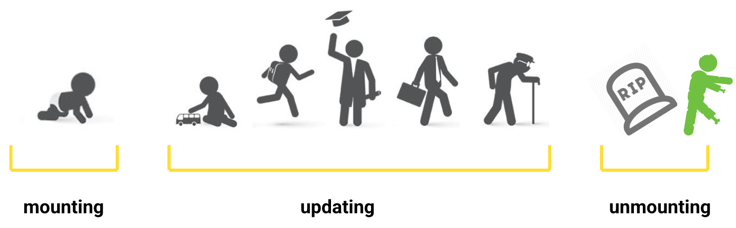

### Homeworks

1. Always look for unique `key` besides array
   - in links: `title`, `link`, `isActive` ?
   - in picturesPartners: set of strings
1. State namings: `[name, setName] = useState(something)`
1. kebab-case for CSS classes
1. Constants should be outside the component -- even better is they're in a separate file
1. Remove unnecessary comments and provide descriptions in PRs
1. State dependent on previous state (example with counter)

❌
```
const [state, setState] = useState(initialValue)

setState([...state, newValue])
```

✅
```
setState((prevState) => ([ ...prevState, newValue ]))
```


### Life cycle



### useEffect

1. Behaviour on different stages
1. Side effects example: setTimeout / events
1. Example: Cat API

