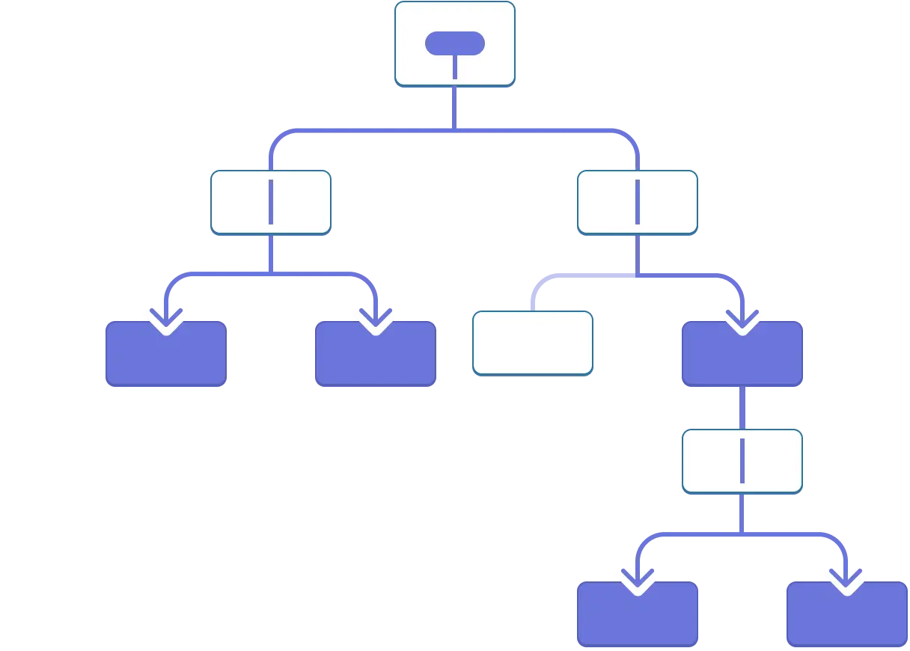

# HYF. React 2. Week 2. Next.js.

Let's start with homework.

Questions?

1. Customisation of MUI

Common things I've seen in your homework:

1. Don't be afraid to use server components in Next.js
1. Do not use `use client` when unnecessary

| -                                        | Server Components                                     | Client Components                        |
|------------------------------------------|-------------------------------------------------------|------------------------------------------|
| How to fetch data?                       | Just in function body (async - await)                 | useEffect (or other hook)                |
| Can use hooks?                           | No                                                    | Yes                                      |
| When to use?                             | Next.js, SEO                                          | Vite (others), want to use hooks, events |
| Can fetch data in render function?       | Yes                                                   | No (only with hooks)                     |
| Where and when is it rendered?           | On the server (before the first request / on request) | On the client (after the first request)  |
| Any React environment / Only in Next.js? | Next.js                                               | Any                                      |
| Loading state while loading data?        | No                                                    | Yes                                      |
| Needs error handling?                    | Yes                                                   | Yes                                      |

Another cool things you can do:

1. **Do not use inline styles** (considered bad practice). Inline styles = attribute `style` in JSX. Use CSS classes
   instead.
2. **Place constants out of the components**. Small optimisation (+ more readable code).
3. **Use special components**. https://nextjs.org/docs/app/api-reference/components
4. **Handle errors**. Every API call can fail. You should handle that.
5. **Use `clsx` for conditional classes**. https://www.npmjs.com/package/clsx

## Context

1. `Cats` example = `props drilling`
   
2. `User` example
   
3. Context -- alternative to props drilling
4. `createContext` and `useContext`
5. How to change the value in the context?
5. Task 1

### Task 1

1. Create new application using `npx create-next-app@latest` **WITH** `tailwind` (otherwise styling won't work)
2. Copy `/accordion` folder from this repository
3. Update it so it would use [Context](https://react.dev/reference/react/useContext#passing-data-deeply-into-the-tree) instead of `props drilling`

### Where to use Context?

1. Theme
2. Data that's needed everywhere (like User data)
3. Localisation
4. Currency for web shops

```
Context = en

{
    en: {
        hello: 'Hello',
        bye: 'Goodbye'
    },
    da: {
        hello: 'Hej',
        bye: 'Farvel'
    }
}
```

## Reducer

https://react.dev/learn/extracting-state-logic-into-a-reducer

1. Write `Friends List` with several actions
2. Reducer = alternative to `useState`.
   Useful for complex state management, but mostly a preference
3. Reducer must be pure function
4. Task 3
5. Duplicate logic with `FriendsContext`
6. Task 4 and 5 (https://github.com/HackYourFuture-CPH/React/blob/main/react2/week2/lesson-plan.md#contexts-with-reducers-22-exercises-30-minutes)

### Task 2

Copy `/reducer` folder from this repository

Currently, the event handlers in `ContactList.jsx` and `Chat.jsx` have `// TODO` comments.
This is why typing into the input doesn’t work, and clicking on the buttons doesn’t change the selected recipient.

Replace these two `// TODOs` with the code to dispatch the corresponding actions.
To see the expected shape and the type of the actions,
check the reducer in `messengerReducer.js`.
The reducer is already written so you won’t need to change it.
You only need to dispatch the actions in `ContactList.jsx` and `Chat.jsx`.

### Task 3

Create a new page with counter and 2 buttons: `+`(increment) and `-`(decrement).

Use Context and Reducer to manage the state.

- **Create a CounterContext**
    - Set up a new context for managing a counter state

- **Implement a Reducer for increment and decrement actions**
    - Define a reducer function to handle increment and decrement actions
    - Update the counter state based on the received actions

- **Consume the CounterContext and update the count**
    - Create a component that consumes the CounterContext
    - Implement buttons or UI elements to dispatch increment and decrement actions
    - Display the current count value from the context

### Task 4

Create a new page with TodoList.
User suppose to be able to add, remove and toggle items in the list.

Use a TodoContext with Reducer to manage the state.

- **Set up a TodoContext with a Reducer**
    - Create a new context for managing a todo list state
    - Define a reducer function to handle actions related to todos (add, remove, toggle)

- **Implement actions for adding, removing, and toggling todos**
    - Define action types and action creators for adding, removing, and toggling todos
    - Update the todo list state based on the received actions in the reducer

- **Consume the TodoContext and display the todo list**
    - Create a component that consumes the TodoContext
    - Render the todo list using the state from the context

- **Use the TodoContext in a Next.js page**
    - Import and consume the TodoContext in a Next.js page component

- **Add functionality to add and remove todos**
    - Implement UI elements (input, buttons) to dispatch actions for adding and removing todos
    - Use the dispatch function from the context to update the todo list state

## Next time

- Go through the homework
- Questions about React and Next.js
- (?) Server Actions

## Homework

1. (Optional) Class exercises (Task 1, 2, 3, 4 from THIS repository)
2. [Meal Sharing App Homework](https://github.com/HackYourFuture-CPH/React/blob/main/react2/week2/homework.md)